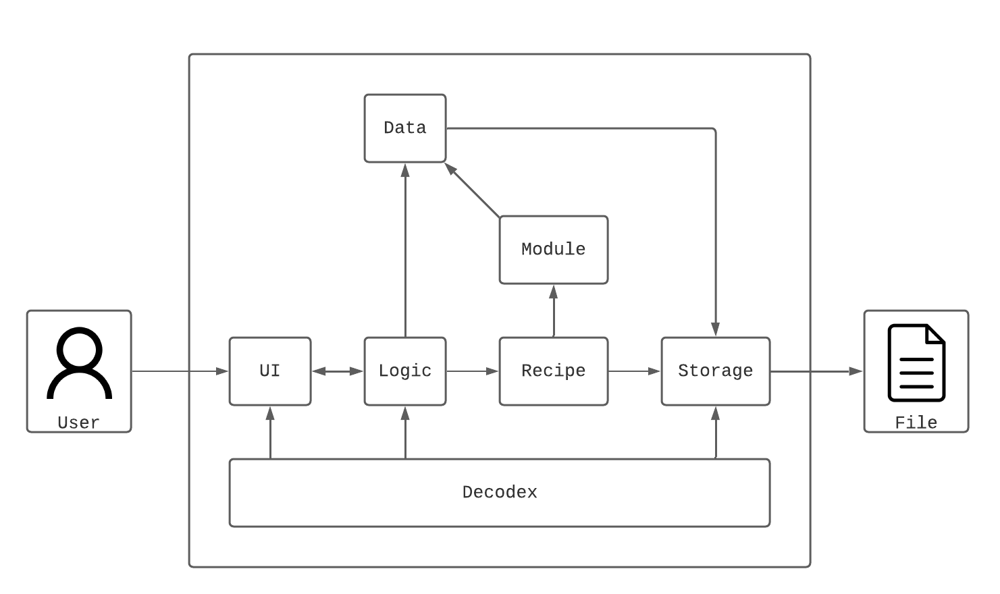

# Developer Guide <!-- omit in toc -->

## Introduction

Decodex is a **Command Line Interface (CLI) application for Capture-The-Flag (CTF) players to quickly transform data from one format to another with extreme ease**. The intuitive interaction can help speed up a player's performance during CTFs and save time without having to manually code the tedious data transformations.

### Purpose of This Guide

The purpose of this guide is to provide more information on our application, Decodex, such as the overall architecture, implementation and design rationales to developers who wish to contribute and enhance Decodex to it's fullest potential. As of the release of this developer guide, it is written for Decodex V2.0.

> ℹ This guide may also serve as a start for software testers to find bugs and possibly edge cases within our applications.
>

### Developer Guide Usage

This developer guide is made for developers who wish to further understand and/or develop **Decodex**.
This guide includes the setup instructions, design, implementation, testing, product scope, and other sections to give developers a better understanding of the application.

## Table of Contents
| Terminology                 | Definition                                                                                                                                                    |
|-----------------------------|---------------------------------------------------------------------------------------------------------------------------------------------------------------|
| Data transformation         | The conversion of one data format to another.                                                                                                                 |
| Application, Program        | Refer to the `Decodex` program. This two terms are used interchangeably in this User Guide.                                                                   |
| Encoding                    | Convert a message into a coded form.                                                                                                                          |
| Decoding                    | Convert a coded message into an intelligible form                                                                                                             |
| Base64, Binary, Hexadecimal | Common types of data encoding standards.                                                                                                                      |
| Console                     | This refers to your command prompt window.                                                                                                                    |
| Argument                    | The additional information you provide to the program's command.                                                                                              |
| Module                      | A self-contained set of instructions to process your data into another form.                                                                                  |
| Recipe                      | Acts as a container for you to select your modules. When multiple modules are selected, this forms a "module chain". By default, you do not have any recipes. |
## Acknowledgements

1. SE-EDU
    1. [AB3 Developer Guide Format](https://se-education.org/addressbook-level3/DeveloperGuide.html)
    2. [AB3 User Guide Format](https://se-education.org/addressbook-level3/UserGuide.html)
    3. [AB3 Setting up and getting started page and related links](https://se-education.org/addressbook-level3/SettingUp.html)
    4. [AB3 Appendix: Requirements](https://se-education.org/addressbook-level3/DeveloperGuide.html#appendix-requirements)
    5. [AB2 Code Structure](https://github.com/se-edu/addressbook-level2)
2. [AY2021S2-CS2113-T10-1](https://github.com/AY2021S2-CS2113-T10-1) (Our TA, kwokyto's Team)
    1. [Developer Guide](https://github.com/AY2021S2-CS2113-T10-1/tp)

### Terminologies

| Terminology                 | Definition                                                                                                                                                    |
|-----------------------------|---------------------------------------------------------------------------------------------------------------------------------------------------------------|
| Data transformation         | The conversion of one data format to another.                                                                                                                 |
| Application, Program        | Refer to the `Decodex` program. This two terms are used interchangeably in this User Guide.                                                                   |
| Encoding                    | Convert a message into a coded form.                                                                                                                          |
| Decoding                    | Convert a coded message into an intelligible form                                                                                                             |
| Base64, Binary, Hexadecimal | Common types of data encoding standards.                                                                                                                      |
| Console                     | This refers to your command prompt window.                                                                                                                    |
| Argument                    | The additional information you provide to the program's command.                                                                                              |
| Module                      | A self-contained set of instructions to process your data into another form.                                                                                  |
| Recipe                      | Acts as a container for you to select your modules. When multiple modules are selected, this forms a "module chain". By default, you do not have any recipes. |

### Symbols

| Name                 | Definition                                                                                            |
|----------------------|-------------------------------------------------------------------------------------------------------|
| :bulb:               | Represents a good tip for you.                                                                        |
| :exclamation:        | Represents something important that you should take note of.                                          |
| :information_source: | Represents additional information regarding commands/features for you better understand how it works. |
| :pen:                | Represents our rationale behind the design/implementation.                                            |

## Getting Started

### Setting Up the Project

1. Forking and cloning
    1. **Fork** our repository.
    2. Then, **clone** the fork onto your computer.

> 💡 For convenience, our repository can be found [here](https://github.com/AY2122S1-CS2113T-T10-3/tp).
>
1. Editor
    1. We highly recommend using Intellij IDEA, which can be downloaded from [here](https://www.jetbrains.com/idea/).
    2. However, you may still use other editors that you prefer. Just take note that most of our set ups are centered around Intellij.
2. Configure JDK
    1. Follow the guide at *[[se-edu/guides] IDEA: Configuring the JDK](https://se-education.org/guides/tutorials/intellijJdk.html)* to ensure Intellij is configured to use **JDK 11**, since our application runs on `Java 11`.
3. Importing project
    1. Follow the guide at *[[se-edu/guides] IDEA: Importing a Gradle project](https://se-education.org/guides/tutorials/intellijImportGradleProject.html)* to import the forked project into Intellij.

> ❗Note: Importing a Gradle project is slightly different from importing a normal Java project.
>
1. Verifying setup
    1. Run the `decodex.Decodex.java` and try a few commands.
    2. [Run the tests](https://se-education.org/addressbook-level3/Testing.html) to ensure they all pass.

### Additional Considerations

1. Configure the coding style
    1. If using IDEA, follow the guide [[se-edu/guides] IDEA: Configuring the code style](https://se-education.org/guides/tutorials/intellijCodeStyle.html) to set up IDEA’s coding style to match ours.
   > 💡 Tip: Optionally, you can follow the guide [[se-edu/guides] Using Checkstyle](https://se-education.org/guides/tutorials/checkstyle.html) to find how to use the CheckStyle within IDEA e.g., to report problems as you write code.
1. Set up CI
    1. This project comes with a GitHub Actions config files (in `.github/workflows` folder). When GitHub detects those files, it will run the CI for your project automatically at each push to the `master` branch or to any PR. No set up required.
2. About our code structure
    1. OOP standardized
    2. Modularized.
        1. Any changes/additions to the current commands would simply require the changes within `Parser.java`.
        2. For any changes/additions to the modules, would simply require changes within the `src/main/java/decodex/modules` folder.
    3. This structure makes it easier for us as well as developers like you to maintain and further extend the capabilities of our application.

## Design

### Architecture

The ***Architecture Diagram*** given above explains the high-level design of Decodex.

Given below is a quick overview of the main components and how they interact with one another.

**Main Components of the architecture**

`Decodex` is responsible initialising the components at launch.

The rest of the program consists of 6 other components:

- `UI`: Handles user input and message output to the console
- `Logic`: Parses user input and executes commands
- `Recipe`: Manages a list of module sequences
- `Module`: Manages a set of encoding and decoding processes
- `Data`: Holds the data that is to be encoded or decoded
- `Storage`: Manages the reading and writing of data to disk

### UI Component

### Logic Component

### Data Component

### Module Component

### Recipe Component

### Storage Component

## Recipe Commands

The following commands are specific to managing modules within recipes.

The command format begins with the command keyword `recipe`, followed by a subcommand keyword, and finally any arguments.

Format: `recipe <subcommand> {arguments}`

Example: `recipe new newRecipe`

### RecipeNewCommand

When the `RecipeCommandParser` recognises the `new` subcommand keyword from the user input, a `RecipeNewCommand` is instantiated.

1. Creates a new `Recipe` object with the provided `recipeName`.
2. Add the newly created `Recipe` into the `RecipeManager`.
3. Sets `recipeName` as the `editingRecipeName` in `RecipeManager`.
4. Prints a successful creation message to the console.

### RecipeSelectCommand

When the `RecipeCommandParser` recognises the `select` subcommand keyword from the user input, a `RecipeSelectCommand` is instantiated.

1. Retrieves the `Recipe` corresponding with the provided `recipeName` from `RecipeManager`.
2. Sets `recipeName` as the `editingRecipeName` in `RecipeManager`.
3. Prints a successful selection message containing the `recipeName` to the console.

### RecipeListCommand

When the `RecipeCommandParser` recognises the `list` subcommand keyword from the user input, a `RecipeListCommand` is instantiated.

1. If `recipeName` is
   1. blank, the `Recipe` with the current `editingRecipeName` is retrieved.
   2. not blank, the `Recipe` with `recipeName` is retrieved.
2. Retrieves the list of `Module` objects belonging to the `Recipe` with `recipeName`.
3. Prints the names and parameters of each `Module` object in the retrieved list.

### RecipePushCommand

When the `RecipeCommandParser` recognises the `push` subcommand keyword from the user input, a `RecipePushCommand` is instantiated.

1. Retrieves the corresponding `Module` with the provided `moduleName` and `parameters` from `ModuleManager`.
2. Retrieves the current editing `Recipe`.
3. Adds the retrieved `Module` into the current editing `Recipe`.
4. Prints the a message of the added `Module` to the console.

### RecipePopCommand

When the `RecipeCommandParser` recognises the `pop` subcommand keyword from the user input, a `RecipePopCommand` is instantiated.

1. Retrieves the latest `Module` added to the `Recipe`, and removes it from the `Recipe` after retrieval.
2. Retrieves the current editing `Recipe`.
3. Prints the a message of the removed `Module` to the console.

### RecipeResetCommand

When the `RecipeCommandParser` recognises the `Reset` subcommand keyword from the user input, a `RecipeResetCommand` is instantiated.

1. Retrieves the `Recipe` with the current `editingRecipeName` is retrieved.
2. Removes all modules contained in the `Recipe`
3. Prints a successful reset message containing the `recipeName` to the console.

### RecipeDeleteCommand

When the `RecipeCommandParser` recognises the `delete` subcommand keyword from the user input, a `RecipeDeleteCommand` is instantiated.

1. Removes the `Recipe` with the `recipeName` from `RecipeManager`.
2. Prints `recipeName` as the deleted `Recipe` to the console.

## Appendix A: Product Scope

### Target User Profile

1. Prefer using CLI over other types
2. Can type fast
3. Does Capture-the-flag (CTF) competitions
4. Requires to use multiple data manipulation techniques at once
5. Is comfortable with CLI
6. May be for both normal and expert users (in terms of technical capabilities)

### Value Proposition

This application helps users (mainly CTF players) to quickly transform data from one format to another (e.g., from plain text to base64-encoded text). It includes features such as the ability to perform basic data transformations with a few simple commands. Furthermore, it also includes the use of recipes to allow for multiple modules to be executed in sequence, which would be useful when multiple consecutive data transformations are needed.

To sum it up, this application helps users to reduce the time needed to transform data from one form to another, especially when consecutive data transformations are required.

## Appendix B: User Stories

| version | priority | as a ... | I want to... | so that i can ... |
|----|----|----|---|----|
| V1.0 | *** | user | input data | perform data manipulation on it |
| V1.0 | *** | user | see the output of my processed data | see the effects of the change |
| V1.0 | *** | user | view a list of modules | see what modules I can use on my data |
| V1.0 | *** | user | add a module | decided to process data with the selected module |
| V1.0 | *** | user | run a module | process data with the selected module |
| V2.0| *** | user | create a new recipe | create different combinations of module chains |
| V2.0 | *** | user | view a list of modules while creating recipe | decide what modules to be added to the recipe |
| V2.0 | *** | user | add a module to the recipe | use it process my data |
| V1.0 | ** | user | remove all modules in the recipe | see my original input data |
| V2.0 | ** | expert user | read input data from a file |  process data that are not printable or terminal-friendly |
| V2.0 | ** | expert user | edit the exported recipes | inspect and modify it in an editor |
| V2.0 | ** | user | see the list of the commands | know what commands I can use |
| V2.0 | ** | user | see the syntax of the commands | know how to use the commands |
| V2.0 | ** | CTF Participant | save my decoded output | reuse the output later |
| V2.0 | ** | user | import recipes from a file | I do not have to create the recipe from scratch/manually |
| V2.0 | ** | user | save my recipes to a file | I can reuse the recipe on a different computer |
| V2.0 | ** | user | list the recipes I have | use them again |

## Appendix C: Non-Functional Requirements

1. Should work on any *mainstream OS* as long as it has Java `11` or above installed.
2. Should be able to have up to 20 recipes without any impact on the performance.
3. A CTF participant should be able to work more efficiently on their CTF challenges compared to manual scripting in terms of time.
4. A user should be able to comfortably use and understand the application if they are within the IT field.
5. A user with above average typing speed for regular English text (i.e. not code, not system admin commands) should be able to accomplish most of the tasks faster using commands than using the mouse.

## Appendix D: Glossary

- **Mainstream OS**: Windows, Linux, Unix, OS-X

## Appendix E: Instructions for Manual Testing