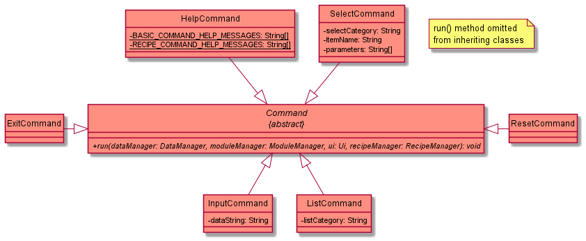
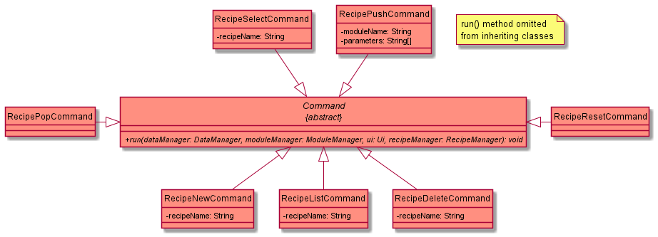
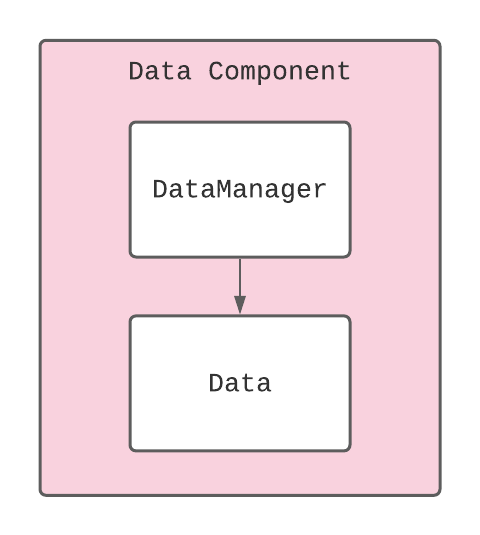
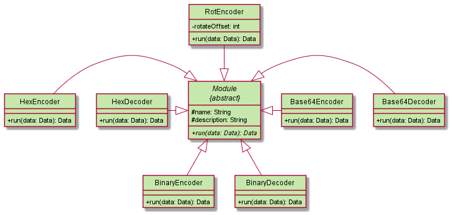

# Decodex Developer Guide <!-- omit in toc -->

## Table of Contents

- [Acknowledgements](#acknowledgements)
- [Setting Up, Getting Started](#setting-up-getting-started)
   - [Setting Up](#setting-up-the-on-your-computer)
      - Forking and cloning repository
      - Editor
      - Configure JDK
      - Importing project
      - Verifying setup
   - [Before writing code](#before-writing-code)
      - Configure the coding style
      - Set up CI
      - About our code structure
- [Design](#design)
   - [Architecture](#architecture)
   - [UI Component](#ui-component)
   - [Logic Component](#logic-component)
   - [Data Component](#data-component)
   - [Module Component](#module-component)
   - [Recipe Component](#recipe-component)
   - [Storage Component](#storage-component)
- [Documentation, Logging, Testing, Configuration, Dev-Ops](#documentation-logging-testing-configuration-and-dev-ops)
- [Appendix A: Product Scope](#appendix-a-product-scope)
- [Appendix B: User Stories](#appendix-b-user-stories)
- [Appendix C: Non Functional Requirements](#appendix-c-non-functional-requirements)
- [Appendix D: Glossary](#appendix-d-glossary)
- [Appendix E: Instructions for Manual Testing (more details below)](#appendix-e-instructions-for-manual-testing)

## Acknowledgements

1. SE-EDU
    1. [AB3 Developer Guide Format](https://se-education.org/addressbook-level3/DeveloperGuide.html)
    2. [Setting up and getting started page and related links](https://se-education.org/addressbook-level3/SettingUp.html)
    3. [AB2 Code Structure](https://github.com/se-edu/addressbook-level2)

## Setting Up, Getting Started

### Setting up the on your computer

1. Forking and cloning
    1. **Fork** our repository.
    2. Then, **clone** the fork onto your computer.

   > For convenience, our repository can be found [here](https://github.com/AY2122S1-CS2113T-T10-3/tp).

1. Editor
    1. We highly recommend using Intellij IDEA, which can be downloaded from [here](https://www.jetbrains.com/idea/).
    2. However, you may still use other editors that you prefer. Just take note that most of our set ups are centered around Intellij.
2. Configure JDK
    1. Follow the guide at *[[se-edu/guides] IDEA: Configuring the JDK](https://se-education.org/guides/tutorials/intellijJdk.html)* to ensure Intellij is configured to use **JDK 11**.
3. Importing project
    1. Follow the guide at *[[se-edu/guides] IDEA: Importing a Gradle project](https://se-education.org/guides/tutorials/intellijImportGradleProject.html)* to import the forked project into Intellij.
> Note: Importing a Gradle project is slightly different from importing a normal Java project.
4. Verifying setup
    1. Run the `decodex.Decodex.java` and try a few commands.
    2. [Run the tests](https://se-education.org/addressbook-level3/Testing.html) to ensure they all pass.
    
### Before writing code

1. Configure the coding style
   1. If using IDEA, follow the guide [[se-edu/guides] IDEA: Configuring the code style](https://se-education.org/guides/tutorials/intellijCodeStyle.html) to set up IDEA’s coding style to match ours.
> :bulb: Tip: Optionally, you can follow the guide [[se-edu/guides] Using Checkstyle](https://se-education.org/guides/tutorials/checkstyle.html) to find how to use the CheckStyle within IDEA e.g., to report problems as you write code.
2. Set up CI
   1. This project comes with a GitHub Actions config files (in `.github/workflows` folder). When GitHub detects those files, it will run the CI for your project automatically at each push to the `master` branch or to any PR. No set up required.
3. About our code structure
   1. OOP standardized
   2. Modularized.
      1. Any changes/additions to the current commands would simply require the changes within `Parser.java`.
      2. For any changes/additions to the modules, would simply require changes within the `src/main/java/decodex/modules` folder.
   3. This structure makes it easier for us as well as developers like you to maintain and further extend the capabilities of our application.
   
## Design

## Design

### Architecture

The ***Architecture Diagram*** given below shows the high-level design of Decodex.

**Main Components of The Architecture**

`Decodex` is responsible for initialising the components at launch.

The rest of the program consists of 6 other components:

- `UI`: Handles user input and message output to the console
- `Logic`: Parses user input and executes commands
- `Recipe`: Manages a sequence of module to be executed
- `Module`: Manages a set of encoding and decoding processes
- `Data`: Holds the data that is to be encoded or decoded
- `Storage`: Manages the reading and writing of data to disk

### UI Component

The `Ui` component consists of:

- `Ui`: Manages access to the `Scanner` object that reads user input and also contains all the methods for printing to the user.

### Logic Component

Below is a partial class diagram that shows an overview of the `Logic` component.

The `Logic` component consists of:

- `Parser`: Handles user input and decides the `Command` object to create.
- `Command`: An abstract class that defines the blueprint for the derived `*Command` classes.
    - `InputCommand`: Takes in a string from the user and sets it as the current `Data` object to perform operations on.
    - `HelpCommand`: Displays all command syntaxes to the user.
    - `ListCommand`: Displays all `Module` objects and loaded `Recipe` objects to the user.
    - `SelectCommand`: Executes a supported `Module` object or a loaded `Recipe` object on the current `Data` object and replaces it with the resulting `Data` object from the execution.
    - `ResetCommand`: Reverts the current `Data` object to a state before any modules/recipes were executed on it.
    - `ExitCommand`: Exits the application.
    - `RecipeNewCommand`: Creates a new `Recipe` object with name provided by the user and creates a save file for it on the file system.
    - `RecipeSelectCommand`: Set a `Recipe` object as the recipe that is currently being edited.
    - `RecipeListCommand`: Display all `Module` objects in a `Recipe` object.
    - `RecipePushCommand`: Appends a `Module` object to the `Recipe` object that is currently being edited.
    - `RecipePopCommand`: Removes the latest `Module` object from the `Recipe` object that is currently being edited.
    - `RecipeResetCommand`: Removes all `Module` objects from the `Recipe` object that is currently being edited.
    - `RecipeDeleteCommand`: Deletes a `Recipe` object from the application as well as its corresponding save file on the file system.

Below is the class diagram showing the association between the `Decodex` class and the `Parser` class.

Below is the class diagram showing the association between the abstract `Command` class and its derived `*Command` classes.

### Data Component

Below is a partial class diagram that shows an overview of the `Data` component.

The `Data` component consists of:

1. `Data`: Used to hold the bytes which the data transformations will act on.
2. `DataManager`: Holds a reference to the current `Data` object and updates it when a `Module` or `Recipe` is executed.

Below is the class diagram showing the association between the `Decodex` class, the `DataManager` class and the `Data` class.

### Module Component

Below is a partial class diagram that shows an overview of the `Module` component.

The `Module` component consists of:

- `Module`: An abstract class that defines the blueprint for the derived `*Encoder` or `*Decoder` classes.
    - `Base64Encoder`, `Base64Decoder`: Performs base64 encoding/decoding operations
    - `HexEncoder`, `HexDecoder`: Performs hexadecimal encoding/decoding operations
    - `BinaryEncoder`, `BinaryDecoder`: Performs binary encoding/decoding operations
    - `RotEncoder`: Performs rotational cipher operation
- `ModuleManager`: Decides and generates the necessary `Module` objects to be added to `Recipe` objects or to be executed on `Data` objects.

Below is the class diagram showing the association between the `Decodex` class, the `ModuleManager` class.

Below is the class diagram showing the association between the abstract `Module` class and its derived `*Decoder` classes.

### Recipe Component

Below is a partial class diagram that shows an overview of the `Recipe` component.

The `Recipe` component consists of:

- `Recipe`: Holds a chain of `Module` objects that, when ran, will execute sequentially on a `Data` object.
- `RecipeManager`: Manages all loaded `Recipe` objects and holds a reference to the `Recipe` object that is currently being edited.

> :pen: The reason for having `Recipe` objects is to enable users to run multiple modules at one go sequentially.
>

### Storage Component

The `Storage` component consists of:

- `Storage` : Performs all file related operations such as reading/saving to files and deleting of files.

To add on, the `Storage` component is designed to access only the following folders:

1. `recipe/` : For recipe files.
2. `output/` : For output data files.
3. `input/` : For input data file.

> :pen: The rationale behind standardizing the specific folders to read/save to, is to ensure that all relevant files can be found in the same location, which makes it easier for users to find the files they are looking for.
>

## Documentation, Logging, Testing, Configuration and Dev-Ops

## Appendix A: Product Scope

## Appendix B: User Stories

## Appendix C: Non Functional Requirements

## Appendix D: Glossary

## Appendix E: Instructions for Manual Testing
