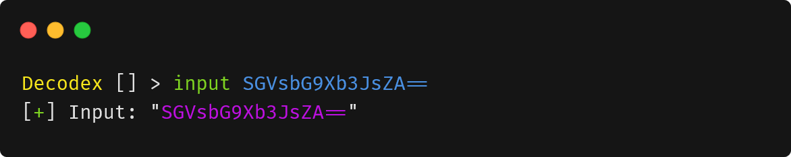
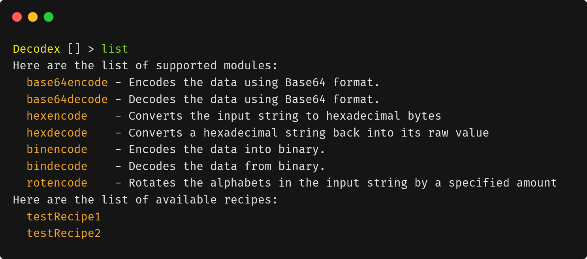
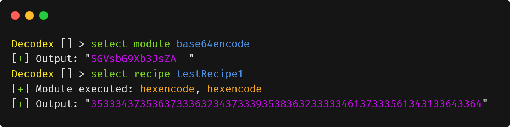
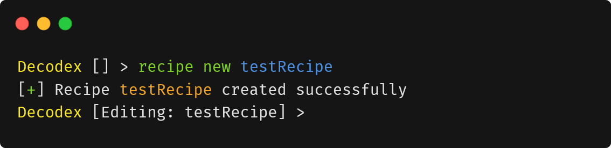
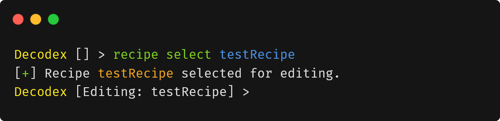
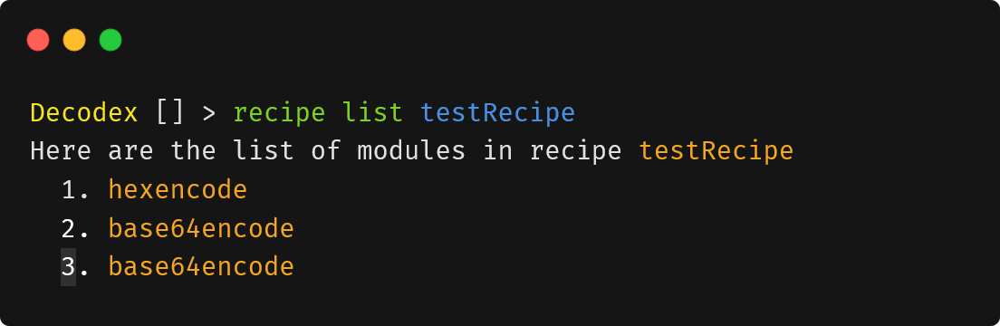
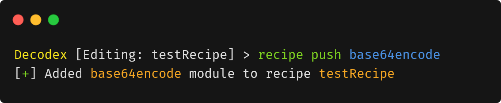
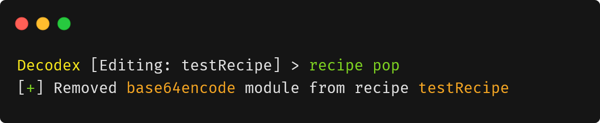
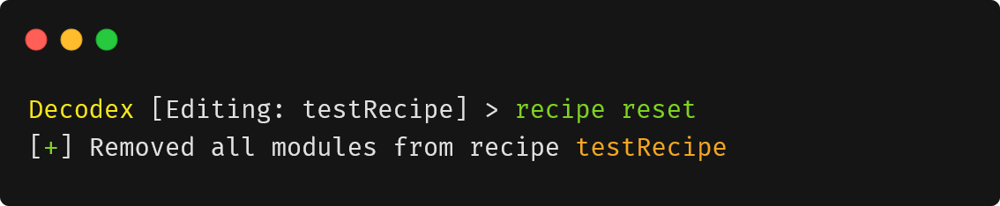
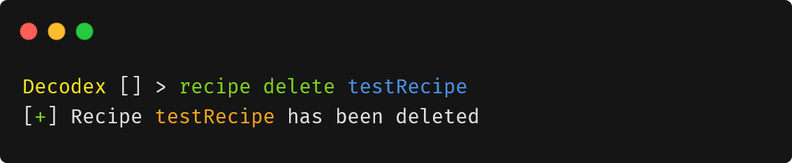

# Decodex User Guide <!-- omit in toc -->

## Introduction

Decodex is a **Command Line Interface (CLI) application for Capture-The-Flag (CTF) players to quickly process data from one encoding format to another with extreme ease**. It also allows you to build recipes, sequences of data processing instructions, to speed up repetitive tasks. The intuitive interaction can help speed up a player's performance during CTFs and save time without having to manually code the tedious data transformations.

This guide serves to help you understand the usage of the program to encode and decode data, as well as create recipes to automate multiple encoding or decoding processes in sequence.

> :information_source: This user guide is tailored for CTF players who have basic understanding of information security concepts.

.png)

## Table of Contents <!-- omit in toc -->
- [Introduction](#introduction)
- [Terminologies](#terminologies)
- [Symbols](#symbols)
- [Quick Start](#quick-start)
- [List of Available Modules](#list-of-available-modules)
- [Features](#features)
  - [Understanding the Application's Prompt](#understanding-the-applications-prompt)
  - [Basic Commands](#basic-commands)
    - [Input of Data: `input`](#input-of-data-input)
    - [List Available Modules or Recipes: `list`](#list-available-modules-or-recipes-list)
    - [Selecting a Module or Recipe: `select`](#selecting-a-module-or-recipe-select)
    - [Resetting Data: `reset`](#resetting-data-reset)
    - [Exiting the Program: `exit`](#exiting-the-program-exit)
  - [Recipe Commands: `recipe`](#recipe-commands-recipe)
    - [Create a New Recipe: `recipe new`](#create-a-new-recipe-recipe-new)
    - [Select a Recipe for Editing: `recipe select`](#select-a-recipe-for-editing-recipe-select)
    - [List Modules in a Recipe: `recipe list`](#list-modules-in-a-recipe-recipe-list)
    - [Add a Module to a Recipe: `recipe push`](#add-a-module-to-a-recipe-recipe-push)
    - [Remove a Module from a Recipe: `recipe pop`](#remove-a-module-from-a-recipe-recipe-pop)
    - [Clear All Modules in a Recipe: `recipe reset`](#clear-all-modules-in-a-recipe-recipe-reset)
    - [Delete a Recipe: `recipe delete`](#delete-a-recipe-recipe-delete)
  - [Saving Recipe to File](#saving-recipe-to-file)
- [Command Summary](#command-summary)
- [FAQ](#faq)

## Terminologies

This section serves to help you better understand the terminologies used in this user guide.

| Data transformation         | The conversion of one data format to another.                                                                                                                 |
| --------------------------- | ------------------------------------------------------------------------------------------------------------------------------------------------------------- |
| Application, Program        | Refers to the Decodex program. This two terms are used interchangeably in this User Guide.                                                                    |
| Encoding                    | Convert a message into a coded form.                                                                                                                          |
| Decoding                    | Convert a coded message into an intelligible form.                                                                                                            |
| Base64, Binary, Hexadecimal | Common types of data encoding standards.                                                                                                                      |
| Console                     | This refers to your command prompt window.                                                                                                                    |
| Argument                    | The additional information you provide to the program's command.                                                                                              |
| Module                      | A self-contained set of instructions to process your data into another form.                                                                                  |
| Recipe                      | Acts as a container for you to select your modules. When multiple modules are selected, this forms a "module chain". By default, you do not have any recipes. |

## Symbols

| Symbol               | Definition                                                                                                |
| -------------------- | --------------------------------------------------------------------------------------------------------- |
| :bulb:               | Represents a good tip for you.                                                                            |
| :exclamation:        | Represents something important that you should take note of.                                              |
| :information_source: | Represents additional information regarding commands/features for you to better understand how to use it. |
| :video_game:         | Represents something optional that you can try out, mostly for exploring or fun.                          |

## Quick Start

1. Ensure you have Java version `11` or above installed on your computer.
   1. If you haven't, you may download it [here](https://www.oracle.com/java/technologies/downloads/#java11-linux).
    > :exclamation: You should download the installation relative to your Operating System.
2. Next, download the latest `decodex.jar` [here](https://github.com/AY2122S1-CS2113T-T10-3/tp/releases).
   1. Simply click on the `decodex.jar` under "Assets" and the download should start.
3. After downloading, you can open up `command prompt`.
    > :bulb: To open command prompt, press `win + r` at the same time, then type and enter `cmd`.
4. Afterwards, you can run `decodex.jar` by typing in `java -jar decodex.jar` and Decodex's prompt should appear. Please also ensure that you are in the same directory as where you have downloaded `decodex.jar`.
   1. In the screenshot below, `decodex.jar` is located in the `Downloads` folder.
   .png)
5. You can try out some of the basic commands below:
   1. `input I am groot`:  Inputs the text data `I am groot` into the program.
   2. `list`: Lists all available modules and recipes that you can use.
   3. `select module base64encode`: Selects and runs the base64-encoding module on the data.
   4. `reset`: Resets the changes made to data - resetting to its original data.
   5. `exit`: Exits the application.
   > :video_game: Side-Quest! You may try to find out what `NTEgMzEgNTIgNDcgNjUgMzAgNGUgNTQgNGQgNmEgNDUgNzggNGQgMzEgNTIgMzk=`
   > using our application! If you are new here, you can continue reading this guide to understand how to unravel this mysterious text!
6. For more information on Decodex's features, please refer to the Features Section.

## List of Available Modules

1. Base64
   1. `base64encode` - Encodes the data using base64 format
   2. `base64decode` - Decodes the data using base64 format
2. Hexadecimal
   1. `hexencode` - Converts the input string to hexadecimal bytes
   2. `hexdecode` - Converts a hexadecimal string back into its raw value
3. Binary
   1. `binencode` - Encodes the data using binary format
   2. `bindecode` - Decodes the data using binary format
4. Rotational Cipher
   1. `rotencode` - Rotates alphabetical characters by a specified integer offset

> :information_source: These are some of the more common encoding/decoding/cipher methods that can be found in CTF competitions.

## Features

> :information_source: Arguments enclosed in `<>` are **mandatory** arguments while arguments enclosed in `{}` are **optional** arguments. For example, `select <moduleName> {moduleArgument}` would mean that `moduleName` is mandatory while `moduleArgument` is optional.

> :information_source: Arguments must be entered in the **exact order and position** as specified in the commands' respective formats.

> :information_source: All commands and arguments are **case-sensitive**.

### Understanding the Application's Prompt

.png)

After running the program, it would display a prompt showing the name of the program `Decodex` , followed by the name of the recipe that is "currently being edited" (if any) in `[]`. This currently edited recipe will be the target for some `recipe` commands such as `recipe push`, `recipe pop` and `recipe reset`.

### Basic Commands

#### Input of Data: `input`

Stores the data to be processed by modules.

Format: `input <data>`

> :information_source: `data` will be treated as text.

Examples:

- `input HelloWorld!` Enters plain text as data.
- `input SGVsbG9Xb3JsZA==` Enters base64-encoded data.

> :exclamation: Note that the program will consider all characters as data following the first space character in the input command. You may observe the leading and trailing whitespaces in the output.

> :exclamation: Non-printable characters (e.g. null characters) may not be correctly displayed and could potentially scramble the user interface.

#### List available modules or recipes: `list`

Shows a list of all available modules or recipes.

Format: `list {category}`

> :information_source: The acceptable values of `category` are `modules` and `recipes` .

> :information_source: When `category` is not specified, both lists of modules and recipes are printed.

Examples:

- `list` Lists modules and recipes.
- `list modules` Lists available modules.
- `list recipes` Lists available recipes.

#### Selecting a Module or Recipe: `select`

Selects a module or recipe and processes the data accordingly. Subsequent selection of modules or recipes will process the transformed data output from the previous module or recipe.

Format: `select module <moduleName> {moduleArgument}`, `select recipe <recipeName>`

> :information_source: `moduleName` is the name of an available module supported by Decodex. `moduleArgument` is an argument that certain modules accept as input.

> :information_source: `recipeName` is the name of an available recipe that is loaded by the program.

Examples:

- `select module base64decode` Runs the `base64decode` module on the current data.
- `select module rotencode 13` Runs the `rotencode` module with argument `13` on the current data.
- `select recipe testRecipe1` Runs the `testRecipe1` recipe on the current data.

#### Resetting Data: `reset`

Resets the transformed data back to the original input.

Format: `reset`

#### Exiting the Program: `exit`

Exit the program.

Format: `exit`

> :video_game: If you are trying out the side-quest from earlier and can't seem to find the solution to it, you may refer to the solution in the picture at the start of the user guide!

### Recipe Commands: `recipe`

#### Create a New Recipe: `recipe new`

Creates a new recipe and sets it as currently being edited.

Format: `recipe new <recipeName>`

Example:

- `recipe new testRecipe` Creates a new recipe with the name `testRecipe`.

#### Select a Recipe for Editing: `recipe select`

Sets a recipe as currently being edited.

Format: `recipe select <recipeName>`

Example:

- `recipe select testRecipe` Selects `testRecipe` as the recipe to be edited.

#### List Modules in a Recipe: `recipe list`

Show all the modules in a recipe, in the order they were added.

Format: `recipe list <recipeName>`

Example:

- `recipe list testRecipe` Lists the modules in the recipe named `testRecipe`.

#### Add a Module into a Recipe: `recipe push`

Adds a module into the recipe that is currently being edited.

Format: `recipe push <moduleName> {moduleArgument}`

Example:

- `recipe push base64encode` Adds the `base64encode` module into the current editing recipe.
- `recipe push rotencode 13` Adds the `rotencode` module with a single argument `13` into the current editing recipe.

#### Remove a Module from a Recipe: `recipe pop`

Removes the most recently added module from the recipe that is currently being edited.

Format: `recipe pop`

#### Clear All Modules in a Recipe: `recipe reset`

Removes all modules from the recipe that is currently being edited.

Format: `recipe reset`

#### Delete a Recipe: `recipe delete`

Deletes a recipe from the program.

Format: `recipe delete <recipeName>`

Example:

- `recipe delete testRecipe` Deletes the recipe with the name `testRecipe`.

## Saving Recipe to File

Saves the recipe into a file. However, this is done automatically for you, so that it is less punishing for you (especially if you often forget to save your documents before exiting).

How it works:

Every time you add a recipe into Decodex, it will save this new recipe into a text file, with the recipe name as the file name, in the `recipe/` folder. Furthermore, any adding or removing of modules from this recipe would also update the corresponding recipe save file.

Example:

If you create a new recipe called "onlyForMe" in Decodex, this will create "onlyForMe.txt" which you can find in the `recipe/` folder. And whenever you run the `recipe push` or `recipe pop` command, it will update "onlyForMe.txt" accordingly.

## Reading/writing data from/to file `[coming soon in the future]`

Coming soon to a cinema near you in the future*…*

## Command Summary

| Action                          | Command Format                                               | Example Usage                                                                         |
|---------------------------------|--------------------------------------------------------------|---------------------------------------------------------------------------------------|
| Enter input data                | `input <data>`                                               | `input HelloWorld!`                                                                   |
| List available modules/recipe   | `list {category}`                                            | `list` `list module`  `list recipe`                                                    |
| Select processing module/recipe | `select module <moduleName>`  &ensp;OR  `select recipe <recipeName>` | `select module base64decode`  `select module rotencode 13` `select recipe testRecipe1` |
| Reset to original data          | `reset`                                                      | `reset`                                                                               |
| Create new recipe               | `recipe new <recipeName>`                                    | `recipe new testRecipe`                                                               |
| Select recipe for editing       | `recipe select <recipeName>`                                 | `recipe select testRecipe`                                                            |
| List modules in recipe          | `recipe list <recipeName>`                                   | `recipe list testRecipe`                                                              |
| Add module to recipe            | `recipe push <moduleName> {moduleArgument}`                  | `recipe push base64encode`  `recipe push rotencode 13`                                 |
| Remove module from recipe       | `recipe pop`                                                 | `recipe pop`                                                                          |
| Clear all modules in recipe     | `recipe reset`                                               | `recipe reset`                                                                        |
| Delete recipe                   | `recipe delete <recipeName>`                                 | `recipe delete testRecipe`                                                            |
| Exit program                    | `exit`                                                       | `exit`                                                                                |

## FAQ

**Q:** How do I transfer my recipes to another computer?  
**A:** Install the app in the other computer and copy the recipe files into the recipe folder.
